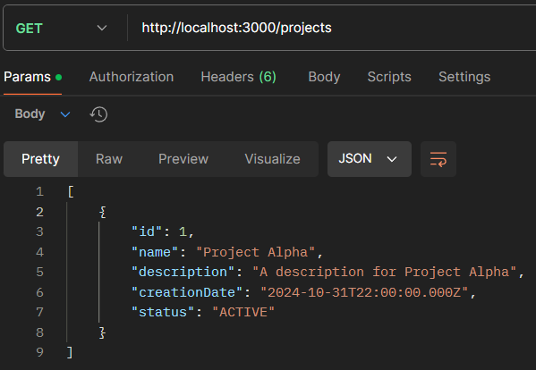
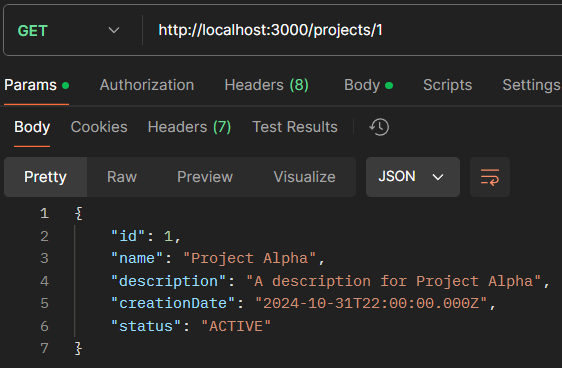
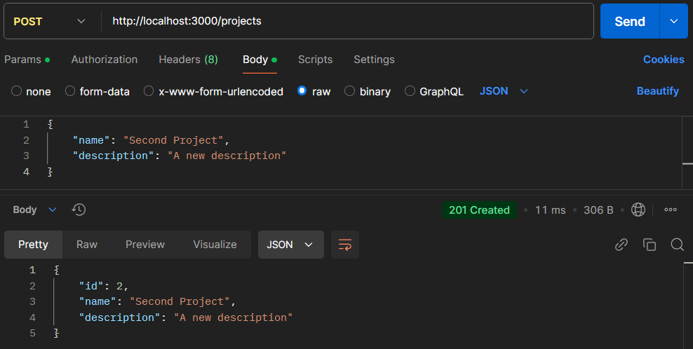
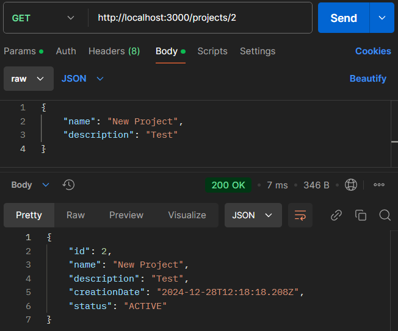
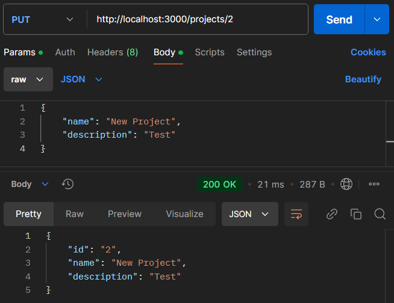
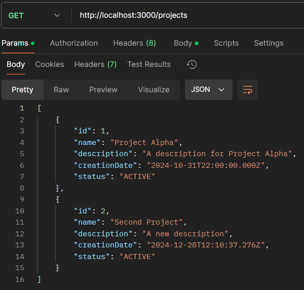
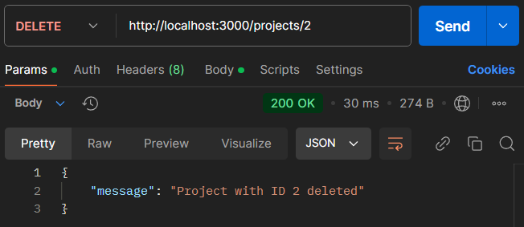
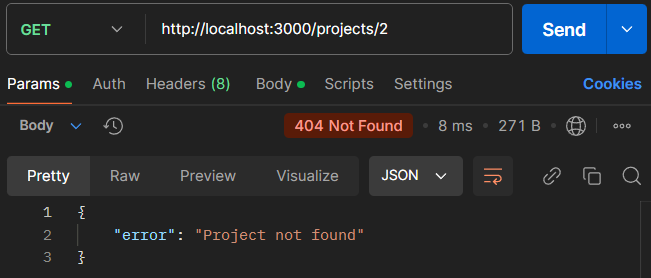

# Тестування працездатності системи
Реалізовано роботу з таблицями `user` та `project`

**Початковий стан таблиць:**

## USER

**GET:**

**POST:**

**PUT:**

**DELETE:**

*Перевірка видалення через GET*

## PROJECT

**GET:**

**POST:**

*Перевірка додавання через GET*

**PUT:**

*Перевірка змін через GET*

**DELETE:**

*Перевірка видалення через GET*

