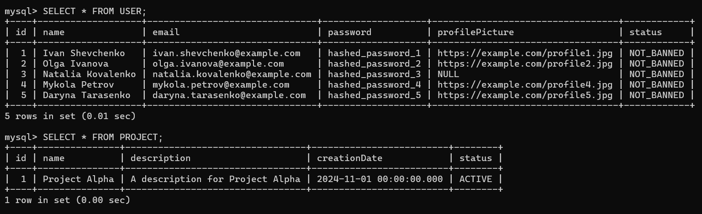
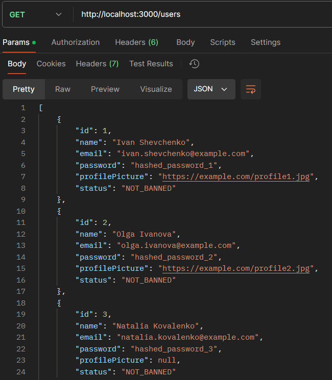
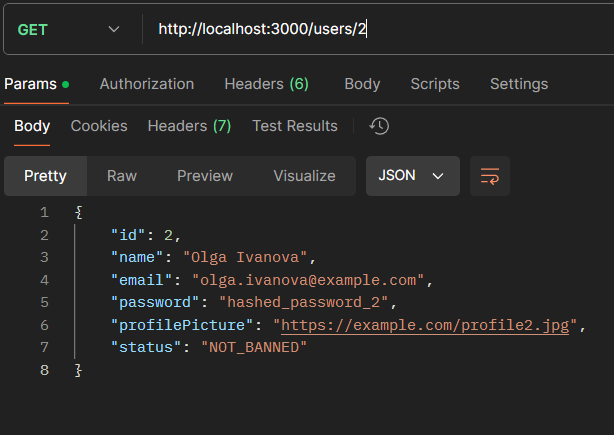
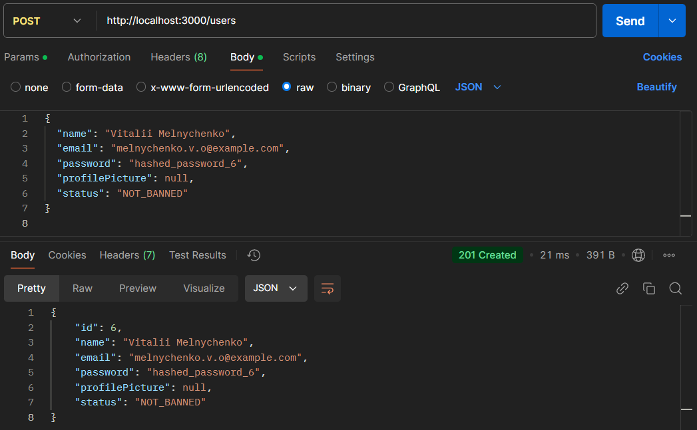
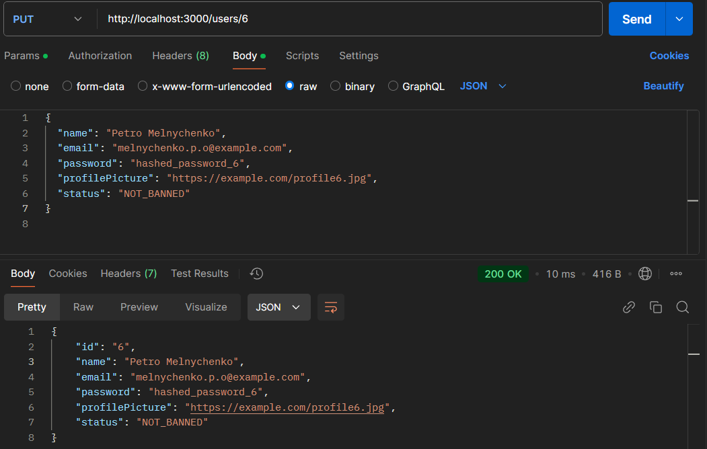
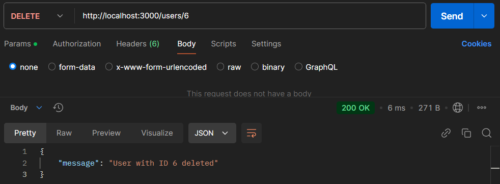
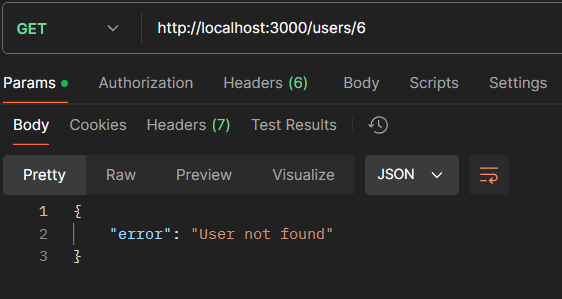

# Тестування працездатності системи
Реалізовано роботу з таблицями `user` та `project`

**Початковий стан таблиць:**

## USER

**GET:**

**POST:**

**PUT:**

**DELETE:**

## PROJECT

**GET:**

**POST:**

**PUT:**

**DELETE:**

